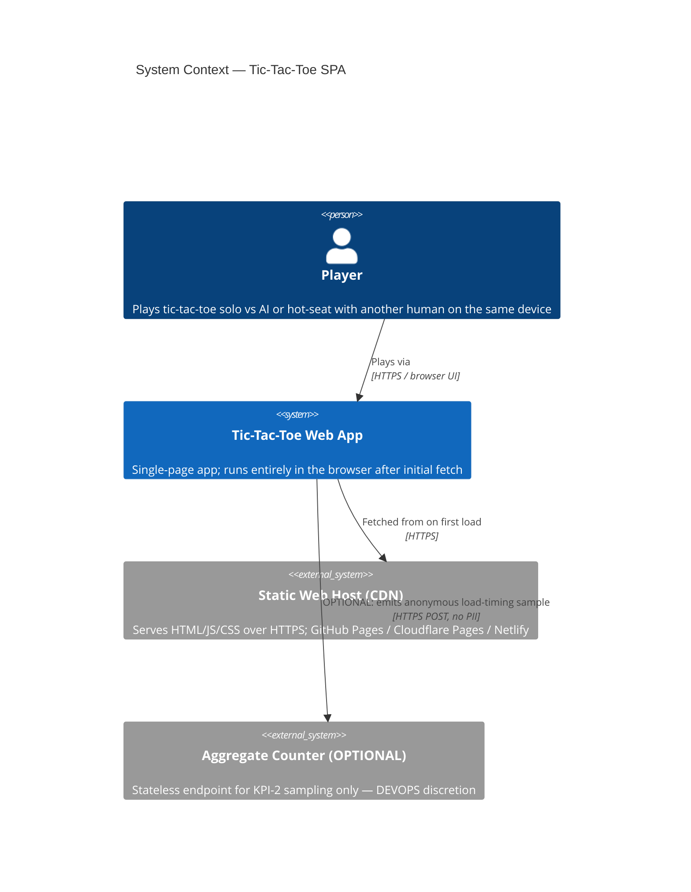
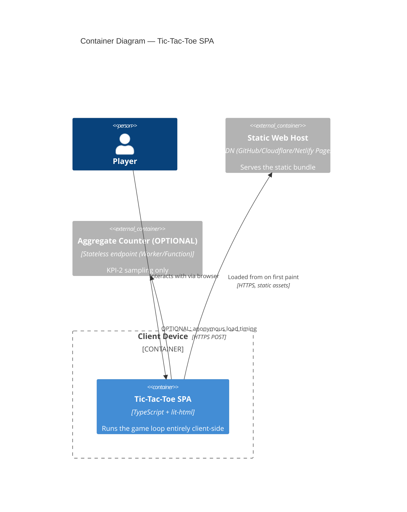

# Architecture Brief — tic-tac-toe project

> **Authoring convention.** This brief is the SSOT for architecture decisions across the project. Each architect owns one top-level section. On this feature, only Application Architecture is materially needed; `## System Architecture` and `## Domain Model` carry explicit N/A placeholders so the structure is preserved for future work.

## Application Architecture

*Owner: solution-architect (Morgan). Wave: DESIGN. Date: 2026-04-21.*

### Overview

The tic-tac-toe application is a single-page web application implemented in **TypeScript** using the **functional programming paradigm** for its domain core. Rendering is handled by **lit-html** (~4KB gzipped) applied directly over vanilla TypeScript — no component framework, no virtual DOM diffing library beyond lit-html's targeted DOM patching. The application ships as a static bundle served by a static web host (GitHub Pages, Cloudflare Pages, or Netlify — final selection deferred to DEVOPS wave per ADR-0004).

Internal structure follows a **ports-and-adapters shape** adapted for a pure-FP core. The pure core — board rules, win detection, AI strategies, game reducer — has zero dependencies on the browser, the DOM, `window`, `document`, `Date`, `Math.random` (injected), or any I/O primitive. It is plain data + pure functions. Around that core sit thin adapters: `render` (lit-html → DOM), `input/keyboard`, `input/pointer`, `announce` (ARIA live region), and a ≤30-line `bootstrap` that wires the loop `input → dispatch → reduce → render → announce`. Dependencies point inward only; the core never imports from adapters.

This shape delivers three things the DISCUSS constraints demand: (1) a single authoritative `boardState` because the reducer is the only thing that can produce a new `GameState`; (2) a uniform AI interface `(state, mark) => [row, col]` because all three difficulties are ordinary pure functions in the core, interchangeable by a typed lookup; (3) hard achievability of the ≤50KB gzipped bundle, the Lighthouse ≥90 / FMP ≤500ms targets, and the WCAG 2.2 AA live-region requirements because lit-html is small, the render path is state → TemplateResult, and the announcer is a first-class adapter rather than an afterthought.

### Quality attributes → architecture drivers

| Quality attribute (ISO 25010) | Requirement (from DISCUSS) | Architecture driver |
| --- | --- | --- |
| Performance Efficiency | Lighthouse perf ≥90; FMP ≤500ms; CLS ≤0.1; TTFM ≤3s on commodity mobile | Static bundle; no framework runtime; lit-html ~4KB; zero network on load; no web fonts; reserved grid height to prevent CLS |
| Functional Suitability | Classic 3x3 rules; three AI difficulties; perfect AI never loses | Pure core with property-based tests; minimax with memoization for perfect AI |
| Usability (Accessibility) | WCAG 2.2 AA; full keyboard; ARIA live region with 1s debounce | Dedicated `input/keyboard` adapter; dedicated `announce` adapter; semantic grid; focus management in render diff |
| Security | No tracking; no third-party fetches on load; no cookies | Static hosting; no runtime external calls; ADR-0004 |
| Reliability | AI never crashes; invalid moves never corrupt state | Typed `Result<T, E>` returns from core; reducer validates actions; no throws across the port |
| Maintainability | Easy to add a new AI difficulty; testable in isolation | Uniform AI signature + strategies lookup; pure functions; core isolated from adapters |
| Portability | Runs on any modern browser from any static host | No server-side rendering dependency; no host-specific API |
| Compatibility | Modern evergreen browsers (ES2022) | TypeScript → ES2022 target; no polyfills beyond tsc lib.d.ts defaults |

### Component decomposition

**Pure core** (zero imports from adapters; zero DOM/browser references):

- **`board`** — Immutable `BoardState` (3×3 typed tuple of `Mark | null`, `Mark = 'X' | 'O'`). Exports:
  - `emptyBoard(): BoardState`
  - `placeMark(state: BoardState, move: Move): Result<BoardState, PlacementError>` where `PlacementError = 'cell_occupied' | 'out_of_bounds' | 'game_over'`
  - `cellsRemaining(state: BoardState): number`
  - `toReadableString(state: BoardState): string` (used by tests and announcer)

- **`win-detector`** — Pure detector. Exports:
  - `detectWin(state: BoardState): WinLine | null` where `WinLine = { mark: Mark; cells: [Coord, Coord, Coord] }` — returns the three coordinates so the animation adapter can draw through them (slice-06)
  - `detectDraw(state: BoardState): boolean`

- **`ai/easy.ts`** — Random legal-move selector. `pick(state, mark): [row, col]`. Takes an optional RNG seed parameter for determinism under test.
- **`ai/medium.ts`** — One-ply lookahead: take a winning move if one exists, else block an opponent winning move, else random. Same signature.
- **`ai/perfect.ts`** — Minimax with memoization over the canonical board key. Same signature. Guaranteed never to lose from any legal position.
- **`ai/index.ts`** — `type AiFn = (state: BoardState, mark: Mark) => [row, col]` and `strategies: Record<Difficulty, AiFn>` with `Difficulty = 'easy' | 'medium' | 'perfect'`. This is the shared contract the DISCUSS constraints call out.

- **`game`** — Top-level reducer. Pure `reduce(gameState, action) => gameState`. Actions:
  - `{ type: 'PLACE_MARK'; coord: [row, col] }`
  - `{ type: 'RESET' }`
  - `{ type: 'SET_MODE'; mode: GameMode }` where `GameMode = 'solo' | 'hot-seat'`
  - `{ type: 'SET_DIFFICULTY'; difficulty: Difficulty }`

  State shape:
  ```
  GameState = {
    board: BoardState;
    mode: GameMode;
    difficulty: Difficulty;
    turn: Mark;                          // whose move is next
    result: 'in_progress' | 'x_wins' | 'o_wins' | 'draw';
    winLine: WinLine | null;             // populated iff result ∈ {x_wins, o_wins}
  }
  ```
  The reducer: validates action against state, computes `board'`, calls `detectWin` / `detectDraw`, sets `result` + `winLine`, advances `turn`. In solo mode, after a human move completes and the game is still in progress, the reducer emits a deterministic "AI to move" marker; the bootstrap loop handles invoking the AI function and dispatching a follow-up `PLACE_MARK` (keeps the reducer pure — AI invocation is I/O-shaped in the sense that easy-mode calls `Math.random`).

**Adapters** (depend on core types; each is narrow, swappable, and independently testable):

- **`render`** — `render(state: GameState): TemplateResult`. Produces the lit-html template tree. Renders the 3×3 grid (`role="grid"`, cells `role="gridcell"` with `aria-label`), difficulty selector, mode toggle, result banner, win-line overlay (slice-06), and OSS source-link footer (slice-07). Bootstrap calls lit-html's `render(templateResult, document.body)`.
- **`input/keyboard`** — Single global `keydown` listener. Maps keys to actions: arrows move focus across cells, `Enter`/`Space` → `PLACE_MARK` at focused coord, `1`/`2`/`3` → `SET_DIFFICULTY`, `H` → `SET_MODE` toggle (only when the game is at turn 0, see slice-05). Returns an `Action | null`; bootstrap dispatches.
- **`input/pointer`** — Delegated click handler on the grid root. Resolves `event.target` to a coord via `data-row` / `data-col` attrs, returns `{ type: 'PLACE_MARK', coord }` action.
- **`announce`** — ARIA live region updater. Holds last-announced state; on each new state computes a diff-derived string (e.g., "X placed at row 2 column 1", "O wins along the top row", "Draw — no moves remaining"), applies a 1s debounce (collapses rapid successive announcements in hot-seat mode), and writes to a `role="status" aria-live="polite"` element.
- **`bootstrap`** — Wires everything. ≤30 lines. Pseudostructure:
  ```
  let state = initial;
  const root = document.querySelector('#app')!;
  const liveRegion = document.querySelector('#announce')!;
  const dispatch = (action) => {
    state = reduce(state, action);
    render(template(state), root);
    announce(state, liveRegion);
    maybeRunAi(state, dispatch);  // schedules AI turn via queueMicrotask in solo mode
  };
  window.addEventListener('keydown', (e) => { const a = keyboard(e, state); if (a) dispatch(a); });
  root.addEventListener('click', (e) => { const a = pointer(e); if (a) dispatch(a); });
  dispatch({ type: 'RESET' });  // first paint
  ```

### Dependency direction

Adapters depend on core. Core depends on nothing (standard library only). This is enforced at review time; for a project of this size a lint rule or architecture-enforcement tool (e.g., `dependency-cruiser` with a rule `src/core/**` cannot import `src/adapters/**`) is appropriate — a low-cost invariant the crafter wave should install.

```
adapters/  ───────►  core/
   │
   └── never the other direction
```

### Error handling

Core functions that can fail return a discriminated union, not a throw. Example:

```
type Result<T, E> = { ok: true; value: T } | { ok: false; error: E };
```

`placeMark` returns `Result<BoardState, PlacementError>`. The reducer handles failure by leaving state unchanged and emitting an ignorable flag (pointer/keyboard adapters can optionally announce a polite "that cell is taken" — deferred to slice-03 behaviour). No `throw` crosses from core to adapter; adapters never see exceptions they didn't cause themselves.

### Testing strategy

- **Core: pure unit tests + property tests.** Every pure function tested in isolation with Vitest. Property tests (fast-check or similar): (a) reducer never produces a `BoardState` with more than 9 marks; (b) `placeMark` is idempotent on rejection (failed placement ⇒ state unchanged); (c) `ai/perfect` never loses — over 100 random games vs `ai/easy` and 100 games vs itself, outcomes are only `perfect_wins | draw`, never `perfect_loses`.
- **Adapters: narrow integration tests.** Playwright exercises exactly what matters — the accepted-move path, the win-banner rendering, the ARIA live region firing at the correct cadence. Not every keystroke combination; just the contract-shaped ones.
- **Accessibility: axe-core in CI** against rendered states (empty board, mid-game, won game, draw). Lighthouse CI for the performance budget.

### KPI → architecture mapping

| KPI (from DISCUSS) | How this architecture achieves it |
| --- | --- |
| KPI-1: Bundle ≤50KB gzipped | lit-html (~4KB) + TS-compiled core (~3-5KB) + adapters (~2-3KB) ≈ 9-12KB well under ceiling. No framework runtime. |
| KPI-2: TTFM ≤3s median on commodity mobile | Static file from CDN; single HTML+JS+CSS; no render-blocking third-party requests. Optional instrumentation as aggregate-counter endpoint — DEVOPS wave. |
| KPI-3: Zero third-party network on load | No fonts, analytics, telemetry, or CDN-hosted libraries. Every asset self-hosted. Enforced by CSP header (DEVOPS). |
| KPI-4: WCAG 2.2 AA | Dedicated `announce` adapter + keyboard adapter; axe-core gates in CI. |
| KPI-5: Lighthouse perf ≥90 / CLS ≤0.1 | Reserved grid dimensions in CSS; no layout shift; no JS-injected above-the-fold content after paint. |
| KPI-6: OSS posture with source link | `render` includes footer with source-repo link; SPDX headers on files. |

### Bundle composition estimate

| Piece | Estimate (gzipped) |
| --- | --- |
| lit-html runtime | ~4.0 KB |
| Pure core (board, win-detector, ai×3, game reducer) | ~3.5 KB |
| Adapters (render template, keyboard, pointer, announce, bootstrap) | ~2.5 KB |
| CSS (grid, palette, win-line animation) | ~1.5 KB |
| HTML shell | ~0.5 KB |
| **Total** | **~12 KB** |

**Budget: 50 KB gzipped. Headroom: ~38 KB (≈ 76% of budget unused).** Comfortable margin for slice-06 win-line animation and any small copy/asset additions.

### C4 Diagrams

#### L1 — System Context



#### L2 — Container



#### L3 — Component (inside the SPA)

```mermaid
C4Component
    title Component Diagram — Tic-Tac-Toe SPA internals

    Container_Boundary(spa, "Tic-Tac-Toe SPA") {

      Component_Boundary(adapters, "Adapters (depend on core)") {
        Component(bootstrap, "bootstrap", "TypeScript", "Wires input→dispatch→reduce→render→announce; ≤30 LOC")
        Component(render, "render", "TypeScript + lit-html", "state → TemplateResult; applied to DOM")
        Component(kb, "input/keyboard", "TypeScript", "Key events → actions (arrows, Enter, 1/2/3, H)")
        Component(ptr, "input/pointer", "TypeScript", "Click events → PLACE_MARK actions")
        Component(announce, "announce", "TypeScript", "State diff → ARIA live region string (1s debounce)")
      }

      Component_Boundary(core, "Pure core (no adapter imports)") {
        Component(game, "game (reducer)", "TypeScript, pure FP", "reduce(state, action) ⇒ state'")
        Component(board, "board", "TypeScript, pure FP", "Immutable BoardState + placeMark + typed errors")
        Component(win, "win-detector", "TypeScript, pure FP", "detectWin ⇒ WinLine | null; detectDraw")
        Component(aiIdx, "ai/index", "TypeScript", "strategies: Record<Difficulty, AiFn>")
        Component(aiE, "ai/easy", "TypeScript, pure FP", "Random legal move")
        Component(aiM, "ai/medium", "TypeScript, pure FP", "One-ply win/block + random")
        Component(aiP, "ai/perfect", "TypeScript, pure FP", "Memoized minimax — never loses")
      }
    }

    Rel(bootstrap, kb, "Subscribes to")
    Rel(bootstrap, ptr, "Subscribes to")
    Rel(bootstrap, render, "Calls with new state")
    Rel(bootstrap, announce, "Calls with new state")
    Rel(bootstrap, game, "Dispatches actions to")
    Rel(bootstrap, aiIdx, "Invokes in solo mode")

    Rel(render, game, "Reads GameState type from")
    Rel(kb, game, "Produces Action for")
    Rel(ptr, game, "Produces Action for")
    Rel(announce, game, "Reads GameState type from")

    Rel(game, board, "Uses placeMark from")
    Rel(game, win, "Uses detectWin / detectDraw from")
    Rel(aiIdx, aiE, "Routes 'easy' to")
    Rel(aiIdx, aiM, "Routes 'medium' to")
    Rel(aiIdx, aiP, "Routes 'perfect' to")
    Rel(aiE, board, "Reads BoardState from")
    Rel(aiM, board, "Reads BoardState from")
    Rel(aiM, win, "Uses detectWin to score")
    Rel(aiP, board, "Reads BoardState from")
    Rel(aiP, win, "Uses detectWin at terminal nodes")
```

### ADR index

- [ADR-0001 — Functional paradigm for the game core](./adr-0001-functional-paradigm.md)
- [ADR-0002 — Vanilla TypeScript + lit-html for rendering](./adr-0002-vanilla-ts-lit-html.md)
- [ADR-0003 — Single game-state reducer with typed actions](./adr-0003-single-game-state-reducer.md)
- [ADR-0004 — Static hosting, zero runtime backend](./adr-0004-static-hosting-zero-backend.md)

---

## System Architecture

*Owner: system-designer (Titan). Wave: DESIGN.*

**N/A — client-side SPA, no distributed system.** This feature has no multi-service topology, no message broker, no backend processes. Deployment topology (static host selection, CDN configuration, CI/CD) is covered in the DEVOPS wave by platform-architect. No system-designer invocation is needed for this feature; should a later feature add server components (e.g., online multiplayer, account system), Titan will author this section before Morgan's section is revised.

---

## Domain Model

*Owner: domain-architect (Hera). Wave: DESIGN.*

**N/A — no complex domain.** The problem domain is the rules of classic 3x3 tic-tac-toe, fully expressed by the `GameState` type and the `board` / `win-detector` modules described in Application Architecture §Component decomposition. There are no bounded contexts, no aggregates beyond the single `GameState`, no ubiquitous-language tensions between stakeholder groups. DDD strategic or tactical patterns add no value at this scale; `GameState` IS the domain model. No domain-architect invocation is needed for this feature.
