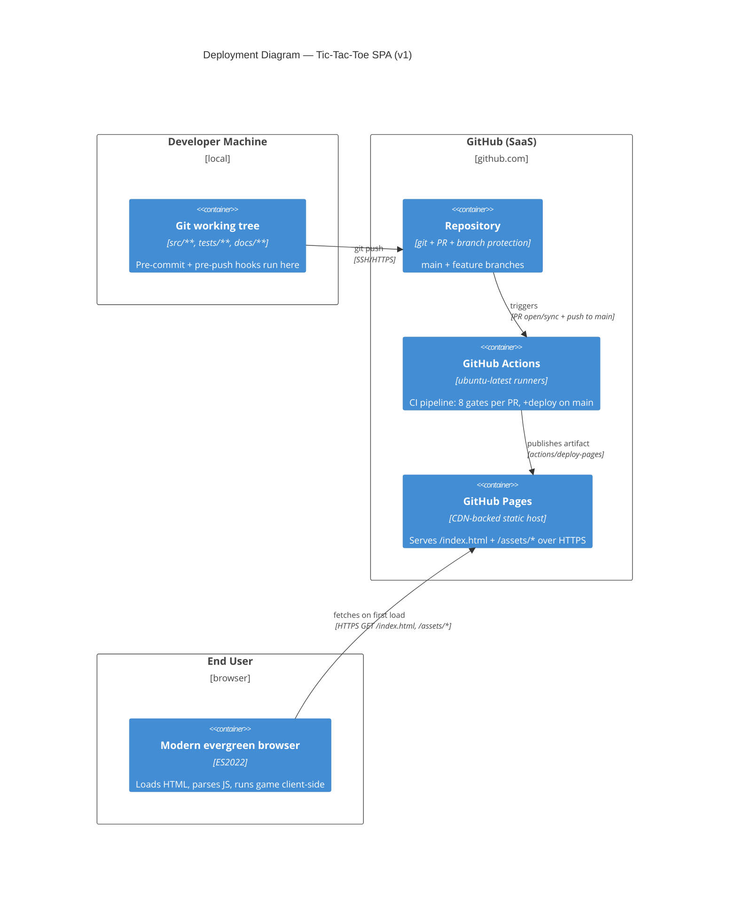

# Platform Brief — tic-tac-toe

> **Authoring convention.** This brief is the SSOT for platform, delivery, and observability decisions across the project. It sits alongside `docs/product/architecture/brief.md` (owned by solution-architect) and carries the platform counterpart. On this feature only the "Delivery Platform" and "KPI Instrumentation" sections are materially needed; system-architecture-grade sections (`## Multi-Region`, `## Disaster Recovery`) carry explicit N/A placeholders for structural consistency.

*Owner: platform-architect (Apex). Wave: DEVOPS (platform-design phase). Date: 2026-04-21.*

## Executive Summary

The tic-tac-toe SPA ships as static assets to **GitHub Pages** via a GitHub Actions pipeline with **8 per-PR quality gates** enforcing the five outcome KPIs (bundle ≤50KB, Lighthouse perf ≥90, a11y ≥95, zero third-party requests, axe-core zero violations) plus the architectural invariant (core cannot import adapters). KPI-2 aggregate-counter instrumentation is **deferred to v2** pending real user traffic. Running cost: **$0/month** at plausible traffic volumes. There is no runtime backend, no database, no secrets, no authentication surface — incident response reduces to `git revert` + redeploy.

## Delivery Platform

### Environment topology

| Environment | URL pattern | Source | Promotion trigger | Purpose |
| --- | --- | --- | --- | --- |
| **PR preview** | `https://dale-stewart.github.io/tic-tac-toe-pr-{N}/` (optional — see §PR preview deployments) | PR branch | Opened/synchronized PR | Visual review, stakeholder demo, exploratory testing |
| **Production** | `https://dale-stewart.github.io/tic-tac-toe/` (or user-scoped equivalent) | `main` branch after merge | Merge to `main` | Live site |

No staging environment. Rationale: the full production environment is a free CDN-backed static host; parity between "staging" and "production" would be 100% and the round-trip cost of an intermediate stage pays for nothing. If the KPI-2 counter is later added, a preview-branch Worker will provide staging-equivalent isolation for that endpoint alone.

### Branching strategy

**GitHub Flow.** Single long-lived `main` branch; short-lived feature/slice branches; PR-based merge with required status checks. Rationale:

- Matches the slice-at-a-time delivery cadence from DISCUSS (≤1 day per slice, 7 slices total — no long-running integration branches make sense at this scope).
- Continuous delivery from `main` to Pages is the simplest deployable shape. No release branches, no cherry-picking, no version-train overhead.
- Aligns with `nw-cicd-and-deployment` skill guidance: GitHub Flow when "teams practicing continuous delivery with code review culture" — solo author with peer-review gates from subagents fits.

Branch protection on `main`:
- Require pull request before merging (1 approval — satisfied by subagent peer review in practice).
- Require status checks to pass: all 8 CI gates (listed in §CI gate matrix).
- Require branches to be up to date before merging.
- Restrict force pushes and deletions.
- Require linear history (no merge commits — squash-merge only).

### Deployment strategy

**Rolling deployment via GitHub Pages' atomic publish.** Every merge to `main` triggers a build; the built artifact (HTML+JS+CSS) is published to the `gh-pages` environment via `actions/deploy-pages`. GitHub Pages serves the new version atomically — no mixed versions visible to clients.

Rationale for NOT using canary / blue-green:
- **Static asset delivery is inherently atomic** at the CDN edge. There is no "50% of users see new, 50% see old" window to engineer. The CDN cache-invalidation window (seconds) is the entire rollout.
- **No server-side state** means no migration-vs-rollback ordering constraints. Rollback is `git revert` + next build.
- **Traffic volume** at a portfolio project is too low to meaningfully observe a canary cohort.

**Deployment steps (production, per merge to `main`):**
1. CI re-runs on `main` commit (all 8 gates).
2. Build emits static artifact in `dist/`.
3. `actions/upload-pages-artifact` uploads.
4. `actions/deploy-pages` publishes to the Pages environment.
5. Post-deploy smoke: curl the live URL, assert HTTP 200, assert `Content-Security-Policy` header present, assert the `data-build-sha` meta tag matches the commit.

**Rollback:** `git revert <bad-sha>` → push → pipeline re-runs → Pages publishes the reverted bundle. Target: **≤10 minutes from detect to restore** (revert commit, CI run ~5 min, Pages propagation ~2 min, smoke ~1 min). Matches DORA Elite "time to restore < 1 hour" comfortably.

### PR preview deployments (OPTIONAL)

GitHub Pages does not natively support per-PR preview URLs without a custom pipeline per preview. Options:

| Option | Cost | Effort | Decision |
| --- | --- | --- | --- |
| **No PR previews** (review bundle artifact only) | $0 | 0h | **RECOMMENDED for v1** |
| PR previews via Cloudflare Pages sidecar | $0 | ~2h | Defer; easy to add later |
| PR previews via `peaceiris/actions-gh-pages` with path-scoped publish | $0 | ~4h | Rejected — complicates Pages config for no v1 value |

**Decision: ship v1 without PR previews.** Reviewers can inspect the uploaded build artifact from CI; the walking skeleton and all seven slices are modest enough to run locally if visual verification is needed. If real reviewer demand for hosted previews emerges (likely never on a solo project), Cloudflare Pages sidecar is the cheapest upgrade path.

### Static host selection

**GitHub Pages.** See `adr-0005-static-host-selection.md` for the full decision. One-line: already-on-GitHub, zero-cost, zero-config, matches the "greenfield solo portfolio" profile.

## CI/CD Pipeline Design

**Full stage-by-stage specification lives in `ci-pipeline.md`.** Summary here:

- **Trigger model:** `pull_request` (to `main`) runs all gates; `push` to `main` runs all gates + deploy; `workflow_dispatch` permits manual re-run. No scheduled Lighthouse runs in v1 (synthetic runs per PR are enough; weekly trend-tracking deferred).
- **Jobs (parallelized where possible):**
  1. `install` — restore pnpm/npm cache, install dependencies.
  2. `lint-and-typecheck` — ESLint + `tsc --noEmit`.
  3. `unit-and-property` — Vitest (unit + fast-check property tests).
  4. `dependency-cruiser` — architectural rule enforcement.
  5. `build` — Vite production build; emit `dist/`.
  6. `bundle-size-check` — gzip-measure `dist/**/*.{js,css}`; fail if total > 50KB gzipped.
  7. `lighthouse-ci` — spin up `npx serve dist/`, run Lighthouse CI; assert perf ≥90, a11y ≥95, bundle budget honored.
  8. `axe-core-a11y` — Playwright + axe-core against 4 canonical board states (empty / mid-game / won / draw); fail on any violation.
  9. `network-assertion` — Playwright headless; record all network requests during page load; assert zero requests to origins other than `self`.
  10. `deploy` (main only) — upload artifact + `actions/deploy-pages`.

- **Gate types:**
  - Gates 2–9: **blocking** on PR (merge forbidden while failing) and blocking on `main` (deploy step skipped).
  - Gate 10: deployment step; runs only on `main` push after 2–9 pass.

- **Local gates (mirror of CI commit stage):**
  - `pre-commit` (lefthook or husky, <30s budget): format (Prettier), lint (ESLint), secrets scan (gitleaks-lite), fast unit subset.
  - `pre-push` (<5min budget): full unit + property suite, type-check, dependency-cruiser.
  - Lighthouse / axe-core / bundle-size / network-assertion remain CI-only (too slow locally; developer can run `npm run check:all` on demand).

### Break-conditions summary

| Gate | Condition | Source of truth |
| --- | --- | --- |
| Lint | Any ESLint error | `.eslintrc` (crafter wave writes) |
| Type-check | Any `tsc` error | `tsconfig.json` |
| Unit + property | Any failing test or property counterexample | Vitest / fast-check |
| Dependency-cruiser | `src/core/**` imports from `src/adapters/**` | `.dependency-cruiser.js` |
| Bundle size | Total gzipped JS+CSS > 50KB | Lighthouse CI + explicit gzip measurement |
| Lighthouse perf | Score < 90 | `lighthouserc.json` |
| Lighthouse a11y | Score < 95 | `lighthouserc.json` |
| axe-core | Any violation on any of 4 canonical states | Playwright + @axe-core/playwright |
| Network assertion | Any request to origin other than `self` during load | Playwright network record |

Any dependency addition >1KB gzipped without a superseding ADR fails `bundle-size-check` and blocks merge, enforcing the constraint from DESIGN peer-review notes.

## Observability Strategy

### Philosophy

Static SPA with zero backend ⇒ the observability model is intentionally thin. There are no SLOs on request latency because there are no server requests; the CDN's availability (GitHub Pages' uptime) is the only production-availability number, and it is opaque to us. Traditional RED / USE / Golden Signals do not apply. Instead we observe:

1. **Build health** (via CI history) — are the gates staying green?
2. **Synthetic quality** (via Lighthouse CI history) — are perf / a11y scores trending correctly?
3. **Host health** (via GitHub Pages status page) — is the site up?
4. **Bundle drift** (via bundle-size job trend) — is the bundle growing toward the 50KB ceiling?

No client-side telemetry is emitted in v1 (guarded by KPI-5). If KPI-2 counter is adopted in v2, that introduces a first genuine observability surface and this section is revised.

### What is monitored, by what, thresholds

| Signal | Tool | Threshold | Response |
| --- | --- | --- | --- |
| CI pipeline green % (last 10 runs on `main`) | GitHub Actions UI | <80% trailing green ⇒ investigate | Manual review |
| Lighthouse perf score trend | Lighthouse CI temporary storage (free tier) | Score drop >5 points PR-over-PR ⇒ investigate | Block merge via gate; root-cause in PR |
| Lighthouse a11y score | Lighthouse CI | <95 ⇒ block | Automated |
| Bundle size (gzipped) | bundle-size-check job | >50KB ⇒ block; >45KB ⇒ warn in PR comment | Automated |
| axe-core violations | Playwright + axe-core | ≥1 ⇒ block | Automated |
| Network requests on load | Playwright | ≥1 non-`self` request ⇒ block | Automated |
| Host availability | status.githubstatus.com (manual check) | Host outage ⇒ post link on README if prolonged | Manual; host is a dependency, not an internal signal |
| Repo security alerts | GitHub Dependabot | Any high/critical CVE ⇒ PR to bump | Dependabot-authored PR |

### SLOs

**None declared internally** for v1. Rationale: synthetic-only measurement, no real user traffic to budget against. The craft targets (Lighthouse ≥90, a11y ≥95, bundle ≤50KB) are **build-time quality gates**, not runtime SLOs — they're enforced per-build rather than budgeted per-window. If KPI-2 counter ships and real traffic appears, availability and TTFM SLOs become meaningful and this section grows.

**Advisory note:** GitHub Pages publishes uptime SLAs in the ~99.95% range. Treat as a de-facto availability floor; do not bake it into any user-facing promise since it's a vendor commitment, not ours.

### Dashboards

No bespoke dashboards in v1. The GitHub Actions run-history page plus Lighthouse CI's built-in temporary-storage trend view are the only dashboards; both are free and zero-maintenance. A Grafana / Datadog / Honeycomb setup would be over-engineering.

### Alerting

No runtime alerting in v1. CI failure appears as a GitHub red X on the PR and as an email to the committer — that *is* the alerting channel. No PagerDuty, no on-call rotation, no Opsgenie. Rationale: static site, single author, traffic near zero; the only "incident" shape possible is "build regression" and it's caught at the gate, not in production.

If the host is down, there is nothing to page about — the fix is GitHub's. Response is to post a note in the README linking to status.githubstatus.com if the outage is prolonged and externally visible.

## KPI Instrumentation Map

| KPI | What it measures | Mechanism | Tool | Frequency | Owner | Dashboard |
| --- | --- | --- | --- | --- | --- | --- |
| **KPI-1** (TTFM ≤3s) | Median time-to-first-move on commodity mobile | Lighthouse synthetic run (mobile form-factor config) on every PR | Lighthouse CI | Per PR | platform pipeline | Lighthouse CI trend view (built-in) |
| **KPI-2** (completion rate ≥70%) | Games completed / games started | **DEFERRED to v2** — see ADR-0006 | — | — | — | — |
| **KPI-3** (a11y, Lighthouse ≥95 + axe 0 violations) | Synthetic accessibility audit | Lighthouse a11y score + axe-core violation count | Lighthouse CI + @axe-core/playwright | Per PR | platform pipeline | Lighthouse CI trend view |
| **KPI-4** (perf ≥90 / CLS ≤0.1 / FMP ≤500ms) | Synthetic performance audit | Lighthouse perf score + explicit CLS/FMP assertions | Lighthouse CI | Per PR | platform pipeline | Lighthouse CI trend view |
| **KPI-5** (0 third-party requests, 0 cookies, 0 PII) | Static privacy posture | Playwright network-request assertion; cookie enumeration; CSP header audit | Playwright + curl-based CSP check | Per PR | platform pipeline | CI run log (pass/fail only — binary signal) |

**Guardrail enforcement:** KPI-5 is a **hard guardrail** — any PR that introduces a third-party request, a cookie, or weakens the CSP header fails `network-assertion` and cannot merge. Bundle-size is similarly a hard guardrail at 50KB.

**KPI-2 resurrection trigger** (from ADR-0006): if real traffic appears OR a stakeholder commissions a completion-rate study, scope the Cloudflare Worker sidecar per ADR-0004 shape constraints and revise this map.

## Environment Topology — Details

Minimal, fully declared. Repeating here for explicit reference.

```
┌─────────────────────────┐
│   local dev machine     │  ──┐
│   (lefthook gates)      │    │
└─────────────────────────┘    │  git push
                               │
                               ▼
┌─────────────────────────┐
│   GitHub                │
│   (repo + Actions)      │  ──┐
│   - PR: 8 gates blocking│    │  on merge to main
│   - main: 8 gates + deploy
└─────────────────────────┘    │
                               ▼
┌─────────────────────────┐
│   GitHub Pages CDN      │  ── serves to end-user browser
│   (production)          │
└─────────────────────────┘
```

No staging, no preview environment in v1, no failover region. If Pages goes down, the site is down for the duration of the vendor outage; this is an accepted tradeoff for the $0 cost and greenfield portfolio scale.

## Incident Response

Scope is deliberately thin. For a static SPA with no runtime backend, the incident surface is:

| Incident class | Detection | Response | Rollback/repair | Est. MTTR |
| --- | --- | --- | --- | --- |
| **Bad code shipped** (functional regression merged to `main`) | User report or follow-up CI run catches it | `git revert <bad-sha>`; push; pipeline rebuilds and redeploys | Automatic via revert + Pages publish | ≤10 min |
| **CI gate regression** (e.g., perf drop after dependency bump) | CI fails on PR | Do not merge; investigate in PR | No prod impact — PR gates blocked | 0 (prevented before prod) |
| **Host outage** (GitHub Pages down) | External — https://www.githubstatus.com | None available; vendor responsibility | Wait for GitHub | Vendor-dependent |
| **Dependency CVE** (Dependabot alert) | GitHub Dependabot | Review PR; merge upgrade; redeploy | Standard deploy cycle | ≤1 day |
| **Bundle > 50KB** (gated pre-merge) | `bundle-size-check` job | PR cannot merge | N/A (prevented) | 0 |
| **CSP violation reported by browser** (future — if report-uri is added) | None in v1 (no reporting endpoint) | Investigate CSP; tighten or patch code | Standard deploy cycle | ≤1 day |

No runbook library, no on-call rotation, no incident-commander role. **Because there is no runtime backend, there are no 3 AM pages possible.** The incident-response chapter of a typical platform brief shrinks to "revert and redeploy" — which is accurate and appropriate.

## Cost Envelope

| Line item | Plan | Expected monthly | Notes |
| --- | --- | --- | --- |
| **GitHub Pages** (hosting, CDN, HTTPS) | Free public-repo tier | $0.00 | 100GB/mo soft bandwidth cap; tic-tac-toe realistic traffic <1GB/mo |
| **GitHub Actions** (CI minutes) | Free public-repo tier | $0.00 | 2000 min/mo free for public repos; each PR ~5 min CI × ~50 PRs/mo = ~250 min |
| **Lighthouse CI temporary storage** | Free | $0.00 | Uses built-in public LHCI temporary storage, no server to host |
| **Cloudflare Worker** (KPI-2 counter) | N/A in v1 | $0.00 | Deferred per ADR-0006; if adopted later, free tier is 100k req/day |
| **Domain** (optional custom domain) | Out of scope v1 | $0.00 | Using `*.github.io` default |
| **Monitoring / APM** | None | $0.00 | No runtime backend to monitor |
| **Secrets management** | None | $0.00 | No secrets in the build or runtime |
| **TOTAL** | | **$0.00/month** | |

The entire platform sits on free public-repo tiers. The only way this becomes non-zero is (a) going private, (b) exceeding Actions minutes (would require ~400 PRs/mo at current CI length), or (c) adopting the KPI-2 counter on a paid tier — all unlikely at portfolio scale.

## Security Posture

Scope is intentionally minimal. There is no authentication surface, no database, no user-uploaded content, no PII storage, no secrets.

### Controls

| Control | Implementation | Verification |
| --- | --- | --- |
| **HTTPS-only** | GitHub Pages serves HTTPS; `Strict-Transport-Security: max-age=31536000; includeSubDomains` via `<meta>` equivalent or Pages config | Manual curl + SSL Labs audit once post-deploy |
| **Content-Security-Policy** | `default-src 'self'; script-src 'self'; style-src 'self' 'unsafe-inline'; img-src 'self' data:; connect-src 'self'; frame-ancestors 'none'; form-action 'none'; base-uri 'self'` — set via `<meta http-equiv="Content-Security-Policy">` in the HTML shell (GitHub Pages does not permit custom response headers; meta-tag CSP is the static-host idiomatic approach) | CI assertion: CSP meta tag present; Playwright assertion: zero non-self network requests |
| **Subresource Integrity** | **N/A** — no third-party scripts or stylesheets loaded. All assets are self-hosted relative paths. If a third-party asset were ever introduced, SRI would become mandatory. | Covered by network-assertion gate |
| **No cookies** | Code-level: no `document.cookie` write path. Enforced by code review + network-assertion which asserts no `Set-Cookie` in any network exchange (trivially satisfied: there are no responses other than asset fetches). | Automated (via network-assertion + manual cookie audit in CI) |
| **No PII storage** | Code-level: no persistent storage, no network endpoints receiving data. | Design invariant (ADR-0004); enforced by absence of endpoints |
| **Dependency vulnerability scanning** | GitHub Dependabot enabled on repo; weekly `npm audit` run in `dependency-cruiser` job (advisory only, not blocking — unless high/critical CVE, which is escalated) | GitHub Dependabot UI |
| **Secrets scanning** | `gitleaks-lite` in pre-commit; GitHub secret-scanning on the repo (on by default for public) | Pre-commit + GitHub Security tab |
| **SAST** | ESLint with `eslint-plugin-security` — advisory only given scope; CodeQL optional, deferred | ESLint job output |
| **SCA** | `npm audit` + Dependabot | Dependabot alerts |
| **DAST** | **Not applicable** — no dynamic endpoints to test. | — |
| **SBOM** | Generated in CI via `cyclonedx-npm` on each `main` build; uploaded as artifact (`sbom.cdx.json`) | CI artifact list |
| **Supply-chain provenance** | GitHub-native provenance on `actions/upload-pages-artifact`; SLSA L2-equivalent | Actions run metadata |

### Threat model

| Threat | Risk | Mitigation |
| --- | --- | --- |
| XSS via untrusted input | **Low** — only input is keyboard/click on a 3×3 grid; no text rendered from user-controlled sources | CSP `script-src 'self'`; lit-html auto-escapes interpolated values |
| Supply-chain (malicious npm dep) | **Medium** — mitigated but real | Pin exact versions in `package-lock.json`; Dependabot + SBOM; small dependency count (TypeScript, lit-html, Vite, Vitest, Playwright, fast-check, axe-core, Lighthouse CI, dependency-cruiser — all well-known) |
| Host compromise (GitHub breached) | **Very low** — vendor risk, not mitigable by us | Accept; platform posture is "static site, if GitHub is compromised everyone has bigger problems" |
| Tampering in transit | **Very low** — HTTPS + HSTS | CSP + HTTPS-only |
| DoS | **Very low** — static CDN-backed; GitHub absorbs DoS traffic | Accept |
| Privacy leak (accidental third-party request added) | **Medium** — mitigated by gate | `network-assertion` CI gate fails PR |

## C4 Deployment Diagram



## Production Readiness Checklist (for DELIVER handoff)

Not all items are verifiable until software-crafter lands the implementation. Items in **bold** are verifiable now from the platform design alone; others are gated on DELIVER wave.

- [x] **Deployment strategy documented and aligned with traffic/risk profile** — rolling atomic via Pages; rationale in §Deployment strategy.
- [x] **Rollback procedure designed before rollout** — `git revert` + redeploy; ≤10 min MTTR; documented in §Incident Response.
- [x] **All 8 CI gates specified with thresholds + break-conditions** — see `ci-pipeline.md`.
- [x] **Local quality gates mirror CI commit stage** — lefthook pre-commit + pre-push; crafter wave installs.
- [x] **Security posture documented** — CSP, HTTPS-only, no cookies, dependency scanning, SBOM.
- [x] **Cost envelope established and $0 at expected scale** — §Cost Envelope.
- [x] **KPI instrumentation design for all 5 KPIs** — KPI-1/3/4/5 wired; KPI-2 deferred with explicit resurrection trigger.
- [x] **Incident response scope right-sized** — revert-and-redeploy; no on-call needed.
- [x] **C4 deployment diagram present** — §C4 Deployment Diagram above.
- [x] **ADRs recorded for non-obvious decisions** — ADR-0005 (host), ADR-0006 (KPI-2 disposition), ADR-0007 (CI gates).
- [ ] CI pipeline YAML exists and runs green on walking skeleton — **DELIVER**.
- [ ] Lighthouse CI config file committed (`lighthouserc.json`) — **DELIVER**.
- [ ] `.dependency-cruiser.js` config file committed — **DELIVER**.
- [ ] axe-core 4-canonical-states test committed — **DELIVER**.
- [ ] Network-assertion Playwright test committed — **DELIVER**.
- [ ] CSP `<meta>` tag in HTML shell — **DELIVER** (crafter writes the shell).
- [ ] Pages environment configured (repo Settings → Pages) — **DELIVER** (one-time repo config).
- [ ] Post-deploy smoke test wired — **DELIVER**.
- [ ] SBOM emission wired in CI — **DELIVER**.
- [ ] Dependabot enabled on repo — **DELIVER** (one-time repo config).

## Multi-Region / DR

**N/A — single vendor-managed CDN.** GitHub Pages handles its own geo-distribution. There is no architecture we own that would benefit from a multi-region strategy. If vendor lock-in becomes a concern, ADR-0005 documents the drop-in replacements (Cloudflare Pages, Netlify); migration is a ~10-minute operation.

## Open items & forward notes

1. **Mutation testing strategy** (per platform-engineering Principle 9): recommended = **per-feature** (Stryker run on changed files per PR, ~5-15 min). Project is <50k LOC with short iteration cycles; per-feature is the right fit from the matrix. **NOT persisted to CLAUDE.md** — Apex recommends; Dale decides. If Dale confirms, future crafter wave installs Stryker and the platform brief grows a ninth CI gate.
2. **KPI-2 counter** remains deferred with a clear resurrection trigger (ADR-0006). No action until real traffic exists.
3. **Custom domain** not pursued in v1. If pursued later, requires DNS config + Pages CNAME file + CSP revisit (probably unchanged since CSP is origin-independent for `'self'`).
4. **Service worker / PWA** is explicitly out-of-scope per ADR-0004; forward-compatible.

## Cross-references

- Sibling SSOT: `docs/product/architecture/brief.md` (application architecture).
- Upstream decisions: `docs/feature/tic-tac-toe/discuss/wave-decisions.md`, `docs/feature/tic-tac-toe/design/wave-decisions.md`.
- KPIs driven: `docs/feature/tic-tac-toe/discuss/outcome-kpis.md`.
- ADRs: `adr-0004` (static hosting — DESIGN), `adr-0005` (host selection — this wave), `adr-0006` (KPI-2 disposition — this wave), `adr-0007` (CI gates — this wave).
- Full pipeline specification: `docs/product/platform/ci-pipeline.md`.
- Wave decisions: `docs/feature/tic-tac-toe/devops/wave-decisions.md`.
